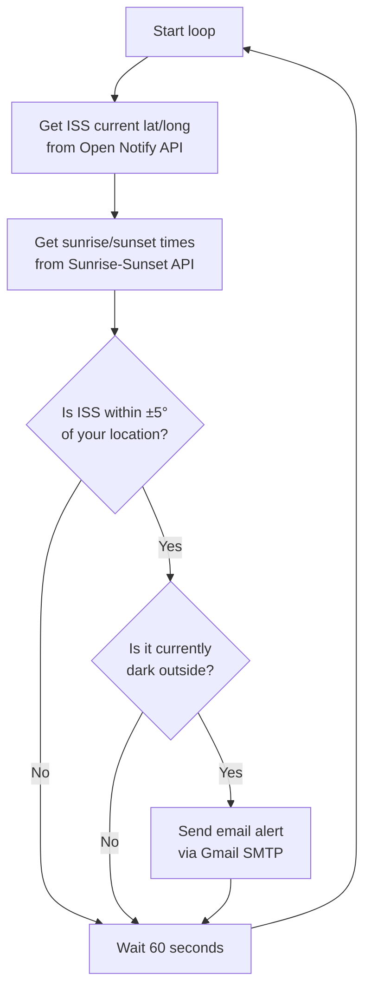

# 🛰️ ISS Overhead Notifier

A Python script that watches the sky for you. It checks, every 60 seconds,
whether the **International Space Station (ISS)** is currently flying near
your location **and** whether it's dark outside — and if both are true, it
emails you so you can go outside and look up.


---

## ✨ Features

- 🌍 Fetches the ISS's real-time position from the [Open Notify API](http://open-notify.org/Open-Notify-API/ISS-Location-Now/)
- 🌅 Fetches sunrise/sunset times for your location from the [Sunrise-Sunset API](https://sunrise-sunset.org/api)
- 📧 Sends you an email alert via Gmail SMTP when the ISS is overhead **and** it's dark
- 🔁 Runs continuously, checking every 60 seconds
- 🔒 Keeps your email credentials out of the codebase using environment variables

---

## 🧠 How It Works



The script loops forever:
1. It asks Open Notify for the ISS's current latitude and longitude.
2. It checks if that position is within **5 degrees** of your own coordinates.
3. It asks Sunrise-Sunset.org for today's sunrise and sunset hours at your location.
4. It checks if the current time is before sunrise or after sunset (i.e. dark).
5. If **both** conditions are true, it emails you an alert.
6. It waits 60 seconds and repeats.

---

## 🛠️ Setup

### 1. Clone the repository

```bash
git clone https://github.com/NinjaVinja/iss-overhead-notifier.git
cd iss-overhead-notifier
```

### 2. Install dependencies

```bash
pip install -r requirements.txt
```

### 3. Set up your credentials

Copy the example environment file and fill in your real details:

```bash
cp .env.example .env
```

Then edit `.env`:

```
MY_EMAIL=your_email@gmail.com
MY_EMAIL_PASSWORD=your_gmail_app_password
```

> ⚠️ **Important:** Use a Gmail **App Password**, not your normal Gmail
> password. You can generate one from your
> [Google Account security settings](https://myaccount.google.com/apppasswords)
> (requires 2-Step Verification to be enabled).
>
> The `.env` file is already listed in `.gitignore`, so it will never be
> uploaded to GitHub — keeping your credentials safe.

### 4. Set your coordinates

Open `iss_overhead.py` and update these two lines with your own location:

```python
MY_LAT = 30.820663   # Your latitude
MY_LONG = 73.442467  # Your longitude
```

You can find your coordinates at [latlong.net](https://www.latlong.net/).

### 5. Run it

```bash
python iss_overhead.py
```

Leave it running in a terminal (or set it up as a background service), and
you'll get an email whenever the ISS passes overhead at night. 🌌

---

## 📁 Project Structure

```
iss-overhead-notifier/
├── iss_overhead.py     # Main script
├── requirements.txt    # Python dependencies
├── .env.example        # Template for environment variables
├── .gitignore          # Keeps .env and cache files out of git
├── iss.jpg             # (Add your own ISS image here)
└── README.md           # You are here
```

---

## 📡 APIs Used

| API | Purpose | Docs |
|---|---|---|
| Open Notify | Current ISS position | http://open-notify.org/Open-Notify-API/ISS-Location-Now/ |
| Sunrise-Sunset.org | Sunrise/sunset times | https://sunrise-sunset.org/api |

---

## 🚀 Possible Improvements

- [ ] Add SMS alerts (e.g. via Twilio) instead of / alongside email
- [ ] Run as a scheduled cloud function instead of a local infinite loop
- [ ] Support multiple recipients or multiple locations
- [ ] Add unit tests for the position and darkness logic

---

## 📄 License

This project is open source and available under the [MIT License](LICENSE).

---

## 🙋 Author

**Muhammad Taha Ahmad** ([@NinjaVinja](https://github.com/NinjaVinja))
